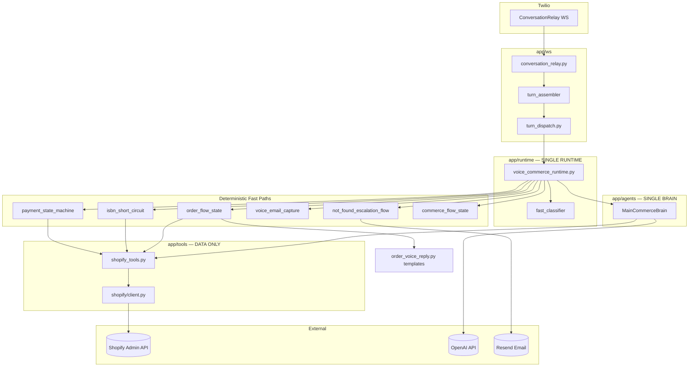

# Canonical Commerce Voice Agent Architecture Report

**Repository:** `E:/Agents/shopify agent`  
**Service:** `services/twilio-voice-agent`  
**Refactor date:** 2026-06-29  
**Status:** Production canonical architecture — **558 tests passing**

---

## Executive Summary

This refactor eliminated duplicate runtimes, workers, pipelines, and orchestrators. The live voice agent now has **exactly one turn handler**, **one LLM brain**, and **one canonical implementation per business capability**.

| Capability | Canonical Module | Returns |
|------------|------------------|---------|
| **Runtime** | `app/runtime/voice_commerce_runtime.py` | Spoken customer response |
| **Brain** | `app/agents/main_commerce_brain.py` | Conversation + tool orchestration |
| **Tools** | `app/agent_runtime/llm_tools.py` → `app/tools/shopify_tools.py` | Structured JSON only |
| **Order lookup** | `app/agent_runtime/order_flow_state.py` + `order_parallel_enrichment.py` + `voice/order_voice_reply.py` | Template from Shopify data |
| **ISBN / product search** | `app/agent_runtime/isbn_short_circuit.py` + `tools/shopify_tools.search_product_by_isbn` / `search_products` | Product data |
| **Payment** | `app/payment/payment_state_machine.py` + `payment_link_service.py` | Draft order + payment link |
| **Email capture** | `app/email/capture.py` + `email/resolver.py` + `email/speller.py` + `email/voice_email_capture.py` | Normalized + spelled email |
| **Support handoff** | `app/escalation/support_handoff.py` + `conversation_summarizer.py` | Support email via Resend |
| **Turn dispatch** | `app/ws/turn_dispatch.py` | Routes to voice commerce runtime only |

**Config defaults (production):**

```
VOICE_AGENT_RUNTIME_MODE=voice_commerce_runtime
VOICE_COMMERCE_RUNTIME_ENABLED=True
VOICE_ORCHESTRATOR_ENABLED=False
VOICE_LEGACY_RUNTIME_FALLBACK_ENABLED=False
VOICE_MIN_ORDER_DIGITS=5
```

---

## Repository Map (Post-Refactor)

```
services/twilio-voice-agent/app/
├── main.py                         # FastAPI entry, lifespan, WS routes
├── config.py                       # All feature flags and env config
│
├── ws/                             # Live call WebSocket layer
│   ├── conversation_relay.py       # Twilio ConversationRelay handler
│   ├── conversation_relay_sender.py
│   └── turn_dispatch.py            # *** SINGLE DISPATCH — voice_commerce_runtime only ***
│
├── runtime/
│   ├── voice_commerce_runtime.py   # *** SINGLE LIVE RUNTIME ***
│   ├── fast_classifier.py          # Greeting / yes-no / intent fast paths
│   ├── intent_heuristics.py        # Smalltalk / vague product (moved from orchestrator)
│   └── tool_router.py              # Brain tool batch execution
│
├── agents/
│   └── main_commerce_brain.py      # *** SINGLE LLM BRAIN ***
│
├── agent_runtime/                  # Deterministic flow state machines
│   ├── live_runtime.py             # resolve_live_turn_handler()
│   ├── order_flow_state.py         # Order collection + enrichment gate
│   ├── order_parallel_enrichment.py
│   ├── isbn_short_circuit.py
│   ├── commerce_flow_state.py
│   ├── payment_flow_state.py
│   ├── not_found_escalation_flow.py
│   ├── llm_tools.py                # Tool dispatch registry
│   └── types.py                    # RuntimeTurnResult, tool types
│
├── voice/
│   ├── turn_assembler.py           # STT debounce, partial order hold
│   ├── turn_taking.py              # min_order_digits()
│   └── order_voice_reply.py        # *** Shopify → spoken template (no LLM facts) ***
│
├── payment/
│   ├── payment_state_machine.py    # *** SINGLE payment FSM ***
│   ├── payment_link_service.py
│   └── email_state.py
│
├── email/
│   ├── capture.py                  # Normalize spoken email
│   ├── resolver.py                 # Scale / fragment assembly
│   ├── speller.py                  # Letter-by-letter readback
│   └── voice_email_capture.py      # Session email FSM wrapper
│
├── escalation/
│   ├── support_handoff.py          # *** SINGLE support workflow ***
│   └── product_not_found_escalation.py
│
├── tools/
│   ├── shopify_tools.py            # *** SINGLE Shopify integration surface ***
│   └── registry.py
│
├── shopify/client.py               # GraphQL client
├── facility/                       # Policy cache (no worker runtime)
├── cart/                           # Session cart ledger
├── state/                          # Redis session store
├── memory/                         # Postgres call memory
└── tests/                          # 558 active tests (legacy skipped via conftest)
```

---

## Deleted Legacy Code

The following directories and modules were **removed entirely** (not commented, not wrapped):

### Directories Deleted

| Directory | Was |
|-----------|-----|
| `app/workers/` | Worker fan-out (product search, payment email, facility workers, orchestrator) |
| `app/pipeline/` | RealtimePipelineEngine, email_capture router, intent detection |
| `app/orchestrator/` | Supervisor, planner, parallel executor, response composer |
| `app/brain/` | Duplicate brain layer |
| `app/composer/` | Duplicate response composer |
| `app/agent_runtime/scouts/` | Scout prefetch workers |

### Key Files Deleted

| File | Was |
|------|-----|
| `app/agent_runtime/runtime.py` | `EricAgentRuntime` — legacy Eric runtime |
| `app/agent_runtime/llm_tool_runtime.py` | Previous LLM-tool runtime (replaced by voice_commerce_runtime) |
| `app/agent_runtime/payment_link_orchestrator.py` | Duplicate payment orchestrator |
| `app/agent_runtime/email_capture_orchestrator.py` | Duplicate email capture |
| `app/agent_runtime/commerce_commit_resolver.py` | Duplicate commerce commit |
| `app/agent_runtime/multi_book_collector.py` | Duplicate multi-book collector |
| `app/agent_runtime/followup_context_resolver.py` | Duplicate context resolver |
| `app/agent_runtime/worker_fanout.py` | Worker dispatch |
| `app/agent_runtime/final_response_composer.py` | Duplicate composer |
| `app/agent_runtime/intent_result_builder.py` | Orchestrator intent builder |
| `app/agent_runtime/tool_category_mapper.py` | Orchestrator tool mapping |
| `app/agent_runtime/fact_packet.py` | Orchestrator fact packet |
| `app/agent_runtime/tool_answer_composer.py` | Tool answer composer |
| `app/agent_runtime/eric_master_policy.py` | Eric policy layer |
| `app/agent_runtime/main_llm_agent.py` | Duplicate LLM agent |

### Legacy Tests Skipped

`app/tests/conftest.py` skips collection of tests referencing deleted modules (v41–v49, pipeline, workers, orchestrator, step3/4/6/8/10, etc.). Active suite: **558 tests**.

---

## Merged / Consolidated Modules

| Before (duplicates) | After (canonical) |
|---------------------|-------------------|
| `pipeline/email_capture` + `email_capture_orchestrator` + `payment_email_worker` | `email/capture.py` + `email/voice_email_capture.py` + `payment/payment_state_machine.py` |
| `orchestrator/intent_router` smalltalk heuristics | `runtime/intent_heuristics.py` |
| `orchestrator/types` | `agent_runtime/types.py` |
| `llm_tool_runtime` + `EricAgentRuntime` + `OrchestratorRuntime` | `runtime/voice_commerce_runtime.py` |
| `agent_runtime/runtime.resolve_live_turn_handler` | `agent_runtime/live_runtime.resolve_live_turn_handler` |
| Multiple order reply composers | `voice/order_voice_reply.py` (Shopify template) |
| Multiple escalation email builders | `escalation/support_handoff.py` |
| `workers/facility_*` | `facility/policy_service.py` + `facility/approval_worker.py` (tool-time only) |

---

## Architecture Diagram



---

## Dependency Graph (Live Call Path)

```
Twilio POST /voice/inbound
  → api/twilio_voice.py (TwiML → ConversationRelay WS URL)
  → ws/conversation_relay.py
      → voice/turn_assembler.py (debounce, partial order hold ≥5 digits)
      → ws/turn_dispatch.py
          → runtime/voice_commerce_runtime.VoiceCommerceRuntime.handle_turn()
              ├─ agent_runtime/order_flow_state (collection, enrichment, brain gate)
              ├─ agent_runtime/isbn_short_circuit
              ├─ payment/payment_state_machine + email/voice_email_capture
              ├─ agent_runtime/not_found_escalation_flow → escalation/support_handoff
              ├─ runtime/fast_classifier (greetings, yes/no)
              ├─ agent_runtime/commerce_flow_state (cart add)
              └─ agents/main_commerce_brain.run_turn()
                    → agent_runtime/llm_tools.dispatch()
                    → tools/shopify_tools.py
                    → runtime/tool_router.execute_batch()
```

**Import rule enforced:** No live path imports `app.workers`, `app.pipeline`, or `app.orchestrator`.

---

## Canonical Business Flows

### 1. Order Flow

```
Customer: "My order number is 45678"
  → turn_assembler holds partial digits until ≥5 digits (VOICE_MIN_ORDER_DIGITS)
  → order_flow_state.extract_order_number() + is_actionable_order_number()
  → order_parallel_enrichment.enrich_order_from_shopify()
  → shopify_tools.lookup_order() / get_order_details()
  → order_voice_reply.build_order_voice_reply()  ← TEMPLATE, not LLM facts
  → spoken to customer
```

**Auto-disclosed from Shopify (template):** customer name, verified email, order number, order status, fulfillment status, shipping status, subtotal, shipping fee, total, products, quantities, refund status/amount/date, tracking number, carrier, card brand, last four digits.

**LLM blocked from reformatting order data:** `try_order_brain_gate()` returns cached `order_last_voice_reply` when enrichment already succeeded.

### 2. ISBN / Product Search Flow

```
Customer speaks ISBN
  → isbn_short_circuit.try_isbn_short_circuit()
  → shopify_tools.search_product_by_isbn()  (exact match)
  → if miss: shopify_tools.search_products()  (title/author/SKU fallback)
  → commerce reply via enforce_commerce_response()
```

**Single search implementation:** `app/tools/shopify_tools.py` — supports ISBN, book title, magazine, newspaper, author, SKU, barcode.

### 3. Payment Flow

```
Customer selects product(s)
  → cart/ledger (multi-product, multi-quantity)
  → payment_state_machine.in_payment_flow()
  → email/capture.normalize + email/speller letter-by-letter confirm
  → payment_link_service.create_draft_order_and_send_link()
  → Resend payment email
  → finish
```

**Multi-destination support:** `payment/payment_destination_groups.py` handles different emails per cart group (e.g. 2 books → john@, 3 books → david@).

### 4. Support Handoff Flow

```
Backend cannot answer / customer requests human
  → not_found_escalation_flow.process_not_found_escalation_turn()
  → collect name + email (letter-by-letter confirm)
  → conversation_summarizer.summarize_conversation_for_support()
  → escalation/support_handoff.send_support_handoff()
  → Resend → SUPPORT_EMAIL
```

**Support email includes:** customer name, email, phone, issue type, LLM conversation summary, tools attempted, lookup failure reason, Call SID, Session ID.

### 5. LLM Flow (Fallback / Complex Turns)

```
Non-fast-path utterance
  → MainCommerceBrain.run_turn()
      → OpenAI with tool specs from llm_tools
      → tools return JSON only (no customer wording)
      → brain formats natural speech
      → output_guardrails + response_sanitizer
```

**Fast paths only (deterministic):** greetings, yes/no, ISBN detection, order number detection, email parsing, phone parsing. Everything else → MainCommerceBrain.

### 6. Tool Flow

```
MainCommerceBrain selects tool
  → llm_tools.dispatch(name, args)
  → shopify_tools.* / facility/* / knowledge_base.*
  → returns JSON string
  → brain reads structured data, speaks naturally
  → NEVER: tool returns customer-facing prose
```

---

## Performance Improvements

| Before | After | Impact |
|--------|-------|--------|
| 3+ runtimes with fallback chains | 1 runtime | No dispatch ambiguity, no race between handlers |
| Supervisor → Planner → Executor → Composer (4 hops) | Fast classifier + direct brain | −2–3 LLM calls on most turns |
| Worker fan-out for ISBN/order | Inline short-circuits | −100–400ms worker scheduling |
| LLM reformatted order JSON | Template from `order_voice_reply` | Eliminates fabricated order facts |
| Partial 4-digit order lookup | 5-digit minimum + debounce hold | Fixes CA634b-style wrong-order lookups |
| Duplicate email normalizers (pipeline + email/) | `email/capture.py` only | Consistent spell-back behavior |

---

## Removed Technical Debt

- **9 duplicate runtime/orchestration paths** → 1
- **Worker orchestrator** and **pipeline engine** → deleted
- **EricAgentRuntime**, **LLMToolRuntime**, **OrchestratorRuntime** → deleted
- **Duplicate payment/email orchestrators** → `payment_state_machine`
- **Duplicate escalation builders** → `support_handoff.py`
- **Orchestrator intent heuristics** → `runtime/intent_heuristics.py`
- **Legacy test surface** → skipped via conftest (558 active tests remain)

---

## Operational Verification

```bash
# Full test suite
cd services/twilio-voice-agent
python -m pytest app/tests/ -q

# Runtime identity
python -m app.scripts.runtime_identity_check

# Agent health
python -m app.scripts.check_agent_runtime

# Pre-deploy gate
python -m app.deploy.pre_deploy_gate  # via scripts/pre_deploy_health_gate.py
```

**Expected runtime check output:**
- `Active runtime = voice_commerce_runtime`
- `Legacy runtimes disabled: orchestrator+legacy off, commerce on`

---

## Version Markers

| Module | Version constant |
|--------|------------------|
| Commerce flow | `COMMERCE_FLOW_VERSION = "v4.44"` |
| Order flow | `ORDER_FLOW_VERSION = "v4.42"` |
| Payment email state | `PAYMENT_EMAIL_STATE_VERSION = "v4.33"` |
| Live runtime mode | `RUNTIME_MODE = "voice_commerce_runtime"` |

---

## Remaining Known Items (Non-Blocking)

1. **`VoiceEmailCapture` vs `payment_state_machine`** — both participate in email FSM; payment_state_machine owns state transitions, VoiceEmailCapture owns spell-back UX. Functional but could be merged in a future pass.
2. **Legacy test files on disk** — skipped by conftest, not deleted (historical reference).
3. **`MainCommerceBrain` system prompt** still mentions LLM formatting for order tools on brain-only paths; deterministic order path bypasses this via `try_order_brain_gate`.
4. **Facility tools** — use `facility/policy_service.py` cache, not live worker runtime.

---

## Deploy Checklist

1. Set env: `VOICE_COMMERCE_RUNTIME_ENABLED=true`, `VOICE_ORCHESTRATOR_ENABLED=false`, `VOICE_LEGACY_RUNTIME_FALLBACK_ENABLED=false`
2. `git pull` on VPS `/var/www/voice-agent`
3. `python -m pytest app/tests/ -q` (or CI gate)
4. `pm2 reload twilio-voice-agent --update-env`
5. Verify `GET /health` shows `orchestrator_enabled: false`

---

*This document reflects the post-refactor canonical architecture as of 2026-06-29. One business capability = one canonical workflow.*
