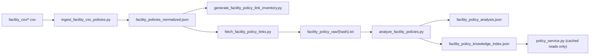

# Facility Policy Link Pipeline

Offline ingestion pipeline for facility mail policy links from CSV data. **Policy URLs are never fetched during live customer calls.**

## Overview



## Commands

Run from `services/twilio-voice-agent`:

### 1. Ingest CSV

```bash
python scripts/ingest_facility_csv_policies.py
```

Normalizes facility CSV files into `app/data/facility_policies_normalized.json`.

### 2. Policy link inventory (audit)

```bash
python scripts/generate_facility_policy_link_inventory.py
```

Writes `docs/FACILITY_POLICY_LINK_INVENTORY.md` with URL counts, domains, duplicates, and gaps.

Optional reachability sample (offline maintenance only):

```bash
python scripts/generate_facility_policy_link_inventory.py --test-reachability --sample 20
```

### 3. Fetch policy links (offline)

```bash
python scripts/fetch_facility_policy_links.py
```

Fetches unique `policy_url` values with timeouts, robots.txt respect, and disk cache:

- `app/data/facility_policy_raw/{hash}.txt`
- `app/data/facility_policy_raw/{hash}.metadata.json`

Options:

```bash
python scripts/fetch_facility_policy_links.py --force          # re-fetch cached URLs
python scripts/fetch_facility_policy_links.py --limit 100      # smoke test
python scripts/fetch_facility_policy_links.py --delay 1.0      # slower, polite crawl
```

### 4. Analyze policies (offline)

```bash
python scripts/analyze_facility_policies.py
```

Cleans raw text, extracts restrictions, and writes:

- `app/data/facility_policy_analysis.json`
- `app/data/facility_policy_knowledge_index.json`

Optional LLM summary (offline only):

```bash
set FEATURE_POLICY_LLM_SUMMARY=true
set OPENAI_API_KEY=sk-...
python scripts/analyze_facility_policies.py
```

### 5. Restart voice service

```bash
pm2 restart twilio-voice-agent
```

## Live agent behavior

| Priority | Source | When used |
|----------|--------|-----------|
| 1 | `facility_policy_analysis.json` | Ingested policy text + CSV merge |
| 2 | `facility_policies_normalized.json` | CSV structured fields / notes |
| 3 | Escalation | Unknown or low-confidence policy |

**Hard rules:**

- No live-call web scraping
- No invented policy answers
- Product risk explanations require both product classification **and** facility policy evidence
- Order-specific questions require verification before private order details

## New voice tools

| Tool | Purpose |
|------|---------|
| `fetch_facility_policy_analysis` | Cached analysis lookup |
| `answer_facility_policy_question` | General facility mail questions |
| `explain_facility_delivery_rejection` | Delivery/return/refund facility reasoning |
| `classify_product_content_for_facility` | Product type + risk flags |

## Modules

| Module | Role |
|--------|------|
| `app/facility/policy_link_inventory.py` | URL audit |
| `app/facility/policy_text_cleaner.py` | Raw text cleanup |
| `app/facility/policy_analyzer.py` | Deterministic restriction extraction |
| `app/facility/product_content_classifier.py` | Product risk matching |
| `app/facility/policy_service.py` | Live cached answers |
