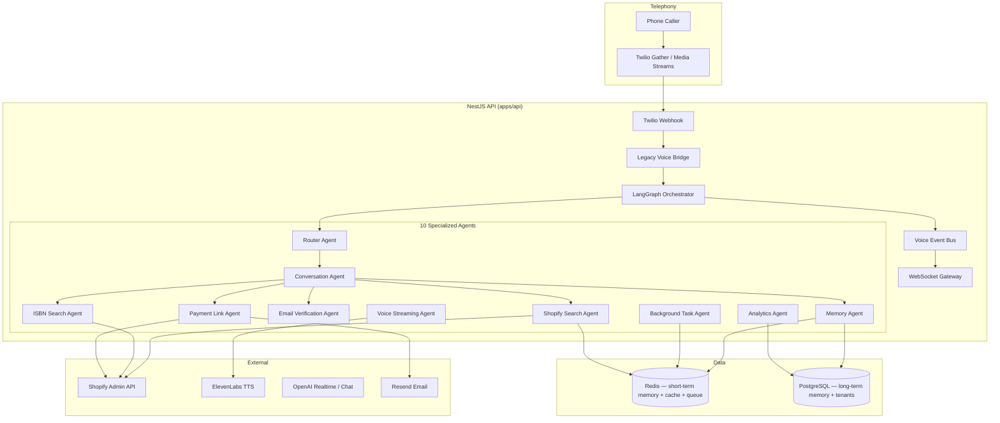

# Realtime Multi-Agent Voice Architecture (2026)

Production architecture for the Shopify bookstore AI phone sales agent — distributed multi-agent orchestration with sub-second perceived latency.

## Executive Summary

The platform replaces the monolithic single-agent voice loop with **10 specialized agents** coordinated by **LangGraph** on the existing **NestJS + Next.js** stack. External integrations (Shopify, ElevenLabs, Twilio, Resend, PostgreSQL, Redis) are preserved; the orchestration layer is rebuilt.

**Enable:** set `REALTIME_MULTI_AGENT_ENABLED=true` in `apps/api/.env`.

---

## Architecture Diagram



---

## The 10 Agents

| # | Agent | Role | Latency Target |
|---|-------|------|----------------|
| 1 | **Router** | Heuristic + optional gpt-4o-mini intent classification | < 50ms heuristic |
| 2 | **Conversation** | Immediate filler + final reply synthesis | < 100ms filler |
| 3 | **Shopify Search** | Title/author product search (cache → live API) | Parallel, 2.5s cap |
| 4 | **ISBN Search** | Barcode/ISBN lookup | Parallel with title search |
| 5 | **Email Verification** | Instant regex + format validation | < 10ms |
| 6 | **Payment Link** | Shopify checkout + Resend email | Background-capable |
| 7 | **Memory** | Redis session + PostgreSQL preferences | Parallel hydrate |
| 8 | **Voice Streaming** | ElevenLabs first-chunk TTS | < 800ms first audio |
| 9 | **Background Task** | BullMQ post-turn jobs | Fire-and-forget |
| 10 | **Analytics** | Call events + stream metrics | Fire-and-forget |

---

## LangGraph Workflow

```
START → router → conversation_filler → parallel_agents → synthesize → END
```

- **Never blocks on Shopify** before setting `immediateFiller` ("Let me check that for you…")
- **Parallel agents** run via `Promise.all` with 2.5s timeout per agent
- **Model escalation:** gpt-4o-mini default; complex support → gpt-5 (when configured)

Source: `apps/api/src/modules/realtime-voice/graph/voice-orchestration.graph.ts`

---

## Folder Structure

```
apps/api/src/modules/realtime-voice/
├── agents/                    # 10 specialized agents
├── bridge/                    # Legacy voice runtime bridge
├── events/                    # In-process event bus
├── graph/                     # LangGraph state machine
├── memory/                    # Redis + PostgreSQL memory
├── orchestrator/              # Main turn processor
├── streaming/                 # OpenAI Realtime adapter
├── websocket/                 # WS gateway for live events
├── workers/                   # BullMQ queue + worker
├── types/                     # Shared types
├── realtime-voice.module.ts
└── realtime-voice.controller.ts
```

---

## Voice Flow (Never Freeze)

1. Customer speaks → Twilio STT → webhook
2. **Router** classifies intent (heuristic, sub-50ms)
3. **Conversation** sets immediate filler — spoken via deferred TwiML poll
4. **Parallel:** Shopify search + ISBN search + cache + memory hydrate
5. **Synthesize** final reply from agent results
6. **Voice Streaming** generates ElevenLabs first-chunk audio
7. **Background + Analytics** run async

---

## Memory Architecture

| Layer | Store | TTL | Contents |
|-------|-------|-----|----------|
| Short-term | Redis `voice:session:{id}` | 1 hour | Turn history, last intent, pending email |
| Long-term | PostgreSQL `CallSession.metadata` | Call lifetime | Preferences, cart, discussed products |
| Search cache | Redis `bookstore:search:*` | 15 min | Product search results |

---

## Redis Caching Strategy

- **Product search:** memory L1 (5 min) + Redis L2 (15 min) via `BookstoreSearchCacheService`
- **Session state:** `VoiceSessionMemoryService`
- **TTS audio:** existing `VoicePromptAudioService` disk/Redis cache
- **Queue:** BullMQ `voice-background-tasks`, `shopify-product-sync`

---

## WebSocket API

**Endpoint:** `ws://host/api/realtime-voice/ws`

```json
{ "type": "turn", "callSessionId": "...", "utterance": "Do you have Dune?" }
{ "type": "subscribe", "callSessionId": "..." }
{ "type": "interrupt", "callSessionId": "..." }
```

Events: `stream.chunk`, `turn.result`, `interrupt.ack`

---

## Environment Variables

```bash
REALTIME_MULTI_AGENT_ENABLED=true
REALTIME_ROUTER_LLM=false          # heuristic-only router (fastest)
REALTIME_ROUTER_MODEL=gpt-4o-mini
OPENAI_REALTIME_MODEL=gpt-4o-mini-realtime-preview
REDIS_URL=redis://127.0.0.1:6379
```

---

## Deployment

### Docker Compose (production)

See `infra/docker/docker-compose.prod.yml` — adds Redis + voice-worker services.

### Kubernetes

Manifests in `infra/k8s/`:
- `api-deployment.yaml` — NestJS API with HPA
- `voice-worker-deployment.yaml` — BullMQ worker
- `redis-statefulset.yaml` — Redis cache/queue
- `ingress.yaml` — nginx ingress with WS upgrade

### PM2

```bash
pm2 start ecosystem.config.cjs
node apps/api/dist/modules/realtime-voice/workers/voice-task.worker.js
```

---

## Observability

Structured JSON logs on every agent completion:
- `voice.multi_agent.turn`
- `voice.agent.completed` / `voice.agent.failed`
- `redis.connected`, `voice.worker.job`

Call events persisted via `AnalyticsAgent` → `CallEvent` table.

---

## Error Handling

- Agent timeouts return partial results; conversation agent synthesizes graceful fallback
- Redis unavailable → in-memory fallback maps
- Shopify failures → "couldn't find a match" without silent freeze
- Payment/email errors logged; caller gets honest status

---

## Full-Duplex Media Stream Pipeline

When all three flags are enabled, inbound calls connect to `wss://host/api/realtime-voice/media-stream`:

```
VOICE_MEDIA_STREAM_ENABLED=true
OPENAI_REALTIME_ENABLED=true
REALTIME_MULTI_AGENT_ENABLED=true
```

**Flow:**
1. Twilio `<Connect><Stream>` → WebSocket at `/api/realtime-voice/media-stream`
2. Inbound mulaw/8000 audio → OpenAI Realtime (g711_ulaw STT + server VAD)
3. Final transcript → LangGraph multi-agent orchestrator (parallel Shopify/email/payment)
4. Response text → ElevenLabs WebSocket TTS (ulaw_8000) → Twilio outbound media
5. Barge-in: `speech_started` → Twilio `clear` + abort TTS

**Fallback:** On pipeline init failure, redirects call to Gather MVP via Twilio REST API when `GATHER_FALLBACK_ENABLED=true`.

**Metrics tracked:** `timeToFirstAudioMs`, `sttLatencyMs`, `agentLatencyMs`, `ttsFirstChunkMs`, `shopifyLatencyMs`, `interruptionCount`, `fallbackCount`

---


1. Deploy with `REALTIME_MULTI_AGENT_ENABLED=false` (default — legacy path)
2. Staging: enable flag, run `pnpm --filter api dev:simulate-voice-flow`
3. Production: enable flag; monitor `/api/realtime-voice/health`
4. Optional: enable `VOICE_MEDIA_STREAM_ENABLED` + OpenAI Realtime for full duplex

**Keep:** Prisma schema, Shopify layer, Twilio webhooks, ElevenLabs, admin dashboard  
**Replace:** Monolithic `LlmAgentOrchestratorService` hot path when flag enabled
